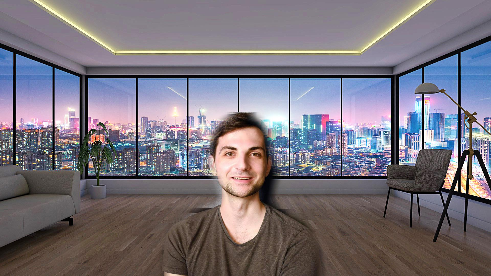

# Potrait-Segmentation-BodyPix

## BodyPix

BodyPix is an open-source machine learning model which allows for person and body-part segmentation with TensorFlow. With default settings, it estimates and renders person and body-part segmentation at 25 fps on a 2018 15-inch MacBook Pro, and 21 fps on an iPhone X.

## Background Blur (Bokeh Effect)

This body part segmentation can be used for foreground-background seperation in potrait photos, and a bokeh effect can be applied using the resulting mask from the model.

* ### Original Image

* ### Bokeh Applied

## Virtual Background

Similarly, the resulting mask can also be used for replacing the background with a virtual background, which are increasingly becoming popular in online conference calls.

* ### Virtual Background Applied

